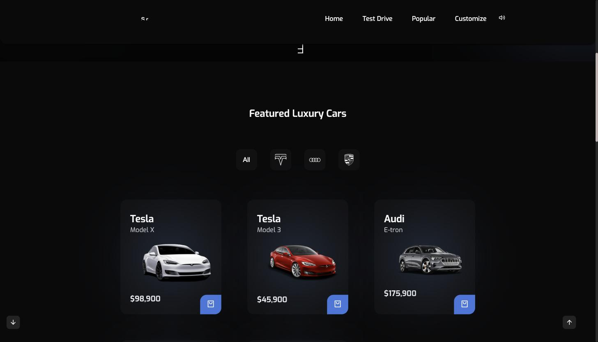
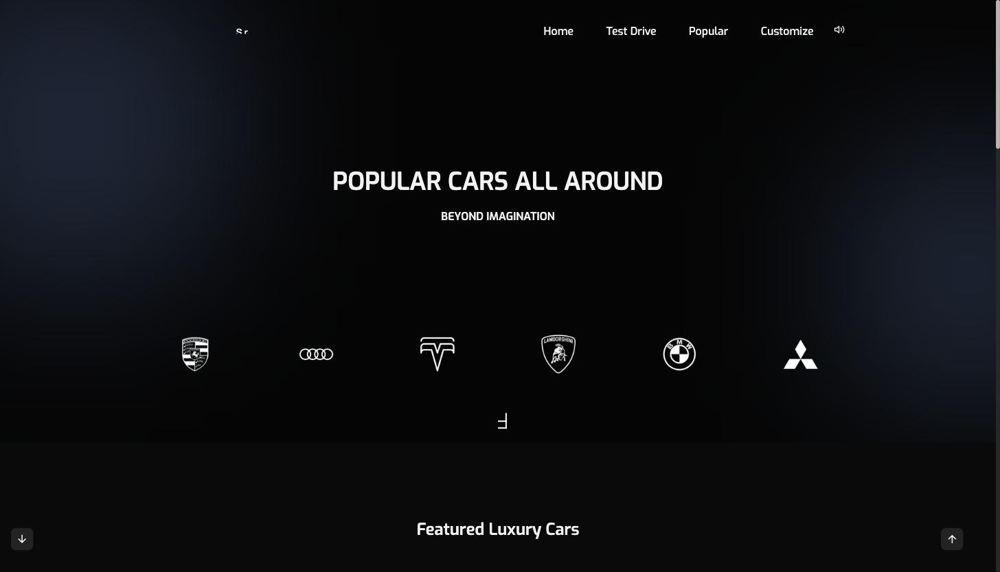
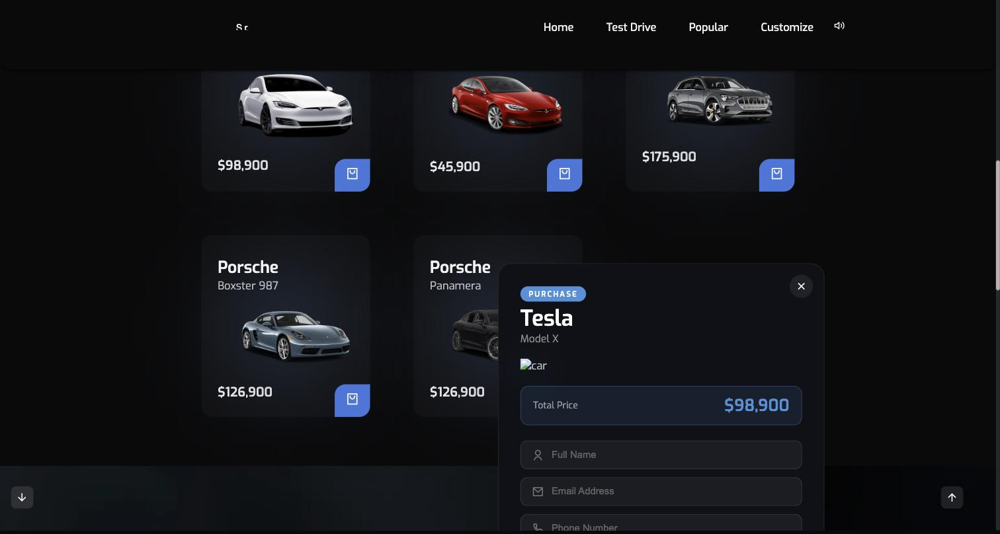

# SpotLight — venta de vehículos eléctricos

Concesionario de vehículos eléctricos de alta gama. Catálogo servido desde
PostgreSQL, compra que se registra en la base, y vista 360° de cada auto.



---

## Cómo se corre

### 1. Requisitos

| | |
|---|---|
| Node | 20.12 o superior (por `process.loadEnvFile`) |
| PostgreSQL | 14 o superior |

### 2. Instalar

```bash
cd car-dealership-project
npm install
```

### 3. Crear la base de datos

```bash
createdb spotlight_dealership
psql -d spotlight_dealership -f database.sql
```

`database.sql` crea las dos tablas. **No trae autos**: hay que cargarlos.

```sql
INSERT INTO autos (marca, modelo, precio, imagen, stock) VALUES
  ('Tesla',   'Model X', 98900,  'assets/img/teslaModelX.png', 4),
  ('Tesla',   'Model 3', 45900,  'assets/img/teslaModel3.png', 8),
  ('Audi',    'E-tron',  175900, 'assets/img/etron.png',       3);
```

### 4. Configurar la conexión

```bash
cp .env.example .env
```

Y se edita `.env` con los datos reales:

```bash
PGUSER=tu_usuario
PGHOST=localhost
PGDATABASE=spotlight_dealership
PGPASSWORD=
PGPORT=5432
PORT=3000
```

> **Ojo con el puerto.** Postgres.app **no siempre usa el 5432** — según la
> versión instalada puede escuchar en el **5433**. Si el servidor arranca pero
> dice que no conecta, es casi siempre esto. Para comprobarlo:
> ```bash
> lsof -nP -iTCP -sTCP:LISTEN | grep postgres
> ```

### 5. Arrancar

```bash
node server.js
```

```
🚗  SpotLight Server corriendo en → http://localhost:3000
✅  Conectado a PostgreSQL — spotlight_dealership
```

Si no aparece la segunda línea, la base no está conectada: el sitio se verá,
pero el catálogo saldrá vacío.

---

## Qué trae

### Catálogo con filtros por marca

Las tarjetas se piden a `GET /api/autos` al cargar la página. **Los precios y el
stock salen de la base**, no del HTML: cambiar un precio es un `UPDATE`, no
tocar código.



### Compra que se registra



El formulario envía a `POST /api/compra`, que guarda la venta y **descuenta el
stock** del auto en la misma transacción.

### Vista 360°

44 fotos por vehículo que giran al arrastrar el ratón. Lo maneja
`assets/js/360deg.js`.

---

## Las páginas

| Archivo | Qué es |
|---|---|
| `index.html` | Portada, con botón de encendido y sonido de motor |
| `searchCars.html` | Catálogo con filtros y compra |
| `customize.html` | Configurador del vehículo |
| `testdrive.html` | Agendar una prueba de manejo |
| `about.html` | Sobre la empresa |

## La API

| Ruta | Qué hace |
|---|---|
| `GET /api/autos` | Catálogo completo |
| `POST /api/compra` | Registra una compra y descuenta stock |
| `GET /api/compras` | Historial de ventas |

## La base de datos

```
autos                        compras
├── id                       ├── id
├── marca                    ├── auto_id ──→ autos.id
├── modelo                   ├── nombre_cliente
├── precio                   ├── email
├── imagen                   ├── telefono
└── stock                    ├── metodo_pago
                             ├── total
                             └── fecha
```

---

## Notas técnicas

**Los vídeos van por Git LFS.** Son 289 MB en cinco archivos, y GitHub rechaza
cualquiera de más de 100 MB fuera de LFS. Para clonarlo hace falta tener LFS
instalado:

```bash
git lfs install
git clone https://github.com/Angel252000/spotlight.git
```

Sin ese paso el repositorio se clona igual, pero los `.mp4` llegan como archivos
de texto con un puntero dentro, y los fondos de vídeo no se ven.

**La conexión sale del entorno, no del código.** Hasta el 21 de septiembre de
2026 estaba escrita a fuego en `server.js`: usuario, host y puerto 5432. Eso
tenía dos problemas — no arrancaba si Postgres usaba otro puerto, y el día que
esto vaya a un servidor la contraseña quedaría en el historial de git para
siempre. Ahora se lee de variables de entorno, con los valores de desarrollo
local como respaldo para que siga arrancando sin configurar nada.

**El frontend no usa framework.** HTML, CSS y JavaScript directo, con tres
librerías: Swiper para los carruseles, MixItUp para los filtros del catálogo y
ScrollReveal para las animaciones de entrada.

> Si al abrir la página todo se ve negro y vacío, es ScrollReveal: deja los
> bloques en opacidad 0 hasta que se hace scroll. No está roto.

## Estructura

```
car-dealership-project/
├── server.js           API Express y servidor de archivos
├── database.sql        Esquema de las dos tablas
├── .env.example        Plantilla de configuración
├── *.html              Las cinco páginas
├── docs/               Capturas de este README
└── assets/
    ├── css/            6 hojas de estilo
    ├── js/             360deg, apiJS, main, y las tres librerías
    ├── img/            129 imágenes, incluidas 44 para la vista 360°
    └── videos/         5 vídeos de fondo (Git LFS)
```
